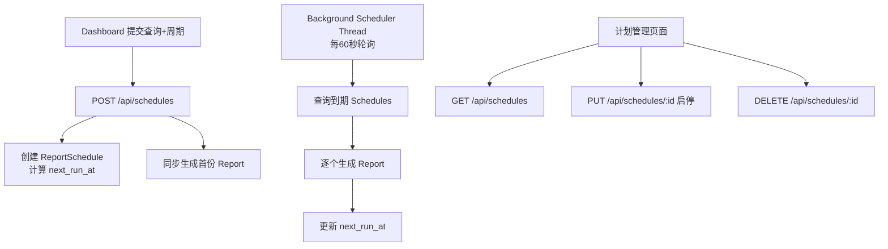
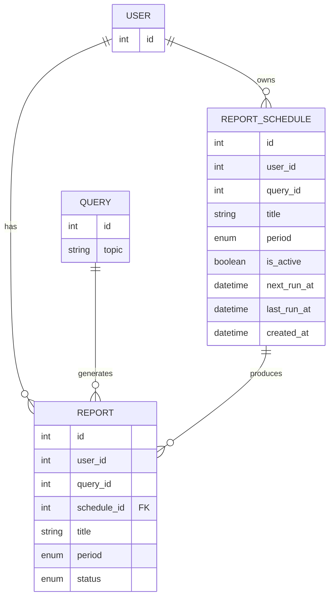

## 产品概述

在现有 MiQroNews 情报平台中，扩展报告系统支持**周期性自动查询与报告生成**。当用户在创建报告时选择周期（日报/周报/月报/年报），系统应在首次生成报告后，按设定周期自动重复执行相同主题的查询并生成新报告，每次聚焦该周期内的最新动态信息。用户可随时手动启停计划，并查看所有计划的下一次执行时间等调度信息。

## 核心功能

- **创建周期性计划**：Dashboard 提交查询时若选择周期，自动创建报告计划（首次同时生成首份报告）
- **定时自动执行**：后台按周期（日/周/月/年）自动检查并执行到期计划，调用 LLM 生成新报告
- **启停控制**：用户可在计划管理页面手动启用或停用任意计划
- **计划视图**：展示所有计划的周期、状态、下次执行时间、最后执行时间、已生成报告数量
- **报告溯源**：报告中标识是否由计划自动生成，并可跳转查看所属计划

## Tech Stack Selection

- **后端**：FastAPI + SQLAlchemy + MySQL（复用现有栈）
- **定时调度**：Python 原生 `threading` + `time.sleep` 轮询方案（无需引入 APScheduler/Celery 等额外依赖，每 1 分钟检查一次到期计划）
- **日期计算**：`python-dateutil`（处理月/年跨度的 `relativedelta`）
- **前端**：React + TypeScript + Tailwind CSS（复用现有栈）

## Implementation Approach

### 策略概述

采用**轮询式后台线程**执行定时任务：FastAPI 启动时启动守护线程，每分钟查询 `report_schedules` 表中 `is_active=True` 且 `next_run_at <= NOW()` 的记录，逐个执行报告生成，完成后更新 `next_run_at` 为下一周期时间。该方案无需消息队列或外部调度服务，与现有架构零侵入。

### 关键设计决策

1. **后台线程 vs APScheduler/Celery**：项目当前无任何任务调度框架。为最小化依赖和运维成本，使用原生 `threading.Thread(daemon=True)` + `time.sleep(60)` 轮询。复杂度低、无需额外进程/端口、与 Uvicorn 的 reload 兼容。
2. **日期计算**：`relativedelta(days=+1/weeks=+1/months=+1/years=+1)` 精确处理月/年跨度的日历计算，避免 `timedelta` 的 30 天近似。
3. **报告生成复用**：将 `reports.py` 中的同步报告生成逻辑提取为 `services/report_generator.py:generate_and_save_report()`，供 API 和调度器共享。
4. **Schedule 与 Report 关联**：`Report` 表新增 `schedule_id` 外键，便于溯源和统计。
5. **Prompt 优化**：周期性报告的 LLM prompt 额外追加"请重点关注该周期内的最新动态与变化"，引导 LLM 输出增量信息。

### Performance & Reliability

- 轮询间隔 60 秒，对数据库和 LLM API 压力极低
- 单线程顺序执行到期计划，避免并发调用 LLM API 触发限流（如 Kimi 429）
- 每个计划执行包裹 `try/except`，单计划失败不影响其他计划
- 数据库 session 在调度线程中独立创建和关闭，避免与主线程 session 冲突

### 架构设计



### Data Model



### Directory Structure Summary

```
backend/
├── app/
│   ├── models.py                    # [MODIFY] 新增 ReportSchedule，Report 加 schedule_id
│   ├── schemas.py                   # [MODIFY] 新增 Schedule 相关 Pydantic schema
│   ├── main.py                      # [MODIFY] 注册 schedules 路由，启动后台调度线程
│   ├── scheduler.py                 # [NEW] 后台调度器线程 + 到期计划执行逻辑
│   ├── services/
│   │   └── report_generator.py      # [NEW] 提取并复用报告生成+保存逻辑
│   └── routers/
│       ├── reports.py               # [MODIFY] create_report 复用 report_generator
│       └── schedules.py             # [NEW] Schedule CRUD + 启停 API
frontend/
└── src/
    ├── App.tsx                      # [MODIFY] 新增 /schedules 路由
    ├── components/
    │   └── Layout.tsx               # [MODIFY] 侧边栏新增"计划管理"导航
    └── pages/
        ├── Dashboard.tsx            # [MODIFY] 提交时若选周期则调 schedules API
        └── ReportSchedules.tsx      # [NEW] 计划列表/启停/删除页面
```

## 设计概述

新增"计划管理"页面与 Dashboard 周期提交联动。整体延续现有暗色主题（Dark Theme）、卡片布局（Card-based）设计风格，使用 Glassmorphism 毛玻璃效果。

## 页面规划

1. **Dashboard（修改）**：周期选择下拉框旁增加提示文案"选择周期后系统将自动按计划重复生成报告"
2. **计划管理页面（新增）**：

- 页面标题 + 统计卡片（活跃计划数 / 今日待执行数 / 总报告数）
- 计划列表表格/卡片：主题、周期标签（日报/周报/月报/年报）、状态开关、下次执行时间、最后执行时间、已生成报告数
- 操作列：启停切换开关、删除按钮
- 点击计划行跳转查看该计划生成的报告列表

## 设计规范

延续现有设计体系，使用相同的暗色背景、卡片边框、渐变按钮样式。

## Agent Extensions

### SubAgent

- **code-explorer**
- Purpose: 在实现前辅助确认关键文件（如 database.py、alembic 配置、现有 API client）的精确路径和用法，避免路径错误
- Expected outcome: 获取 database.py 中 SessionLocal 的创建方式、确认 alembic 是否需要手动 migration