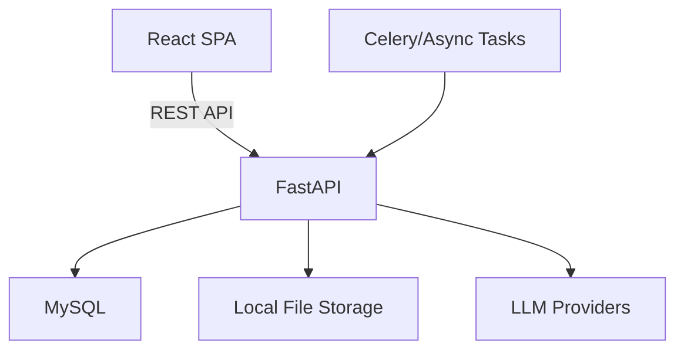

## 产品概述

公司情报站是一款面向外部用户的 Web 应用，用户通过自然语言输入查询主题，系统调用大语言模型生成分析内容，并支持按天、周、月、年生成 Markdown 格式的汇总报告。系统具备多报告趋势分析能力，支持用户数据隔离及报告公开共享。

## 核心功能

- **智能查询**：用户通过自然语言输入查询主题，后端调用 LLM 生成情报分析内容
- **报告生成**：支持按天、周、月、年维度生成 Markdown 格式汇总报告并持久化存储
- **趋势分析**：基于多份历史报告进行趋势对比与数据洞察分析
- **用户管理**：支持用户名密码注册登录，系统可配置新注册用户是否需要管理员审核
- **数据隔离**：普通用户仅能查看自己的查询记录与报告
- **公开共享**：用户可将特定报告设置为公开，生成分享链接供他人访问
- **系统配置**：管理员可在后台配置 LLM 服务商（DeepSeek/OpenAI/Claude 等）及 API 密钥

## 技术栈选型

- **前端**：React 18 + TypeScript + Vite + Tailwind CSS + shadcn/ui
- **后端**：Python 3.11+ + FastAPI + SQLAlchemy 2.x + Pydantic
- **数据库**：MySQL 8.0（通过 SQLAlchemy ORM 操作）
- **认证**：JWT（access token + refresh token 机制）
- **LLM 调用**：支持多模型配置，统一抽象层封装 DeepSeek / OpenAI / Claude 等接口
- **报告存储**：数据库保存元数据，Markdown 正文以文件形式存储于本地文件系统
- **部署**：本地部署，前后端分离运行

## 实现策略

采用分阶段迭代方式，先完成最小可用版本（MVP），再逐步叠加高级功能。MVP 阶段聚焦用户认证、单次查询生成报告、报告查看；第二阶段加入周期性报告任务与历史管理；第三阶段实现趋势分析、公开共享及后台管理。

### 架构设计

- **前端架构**：React Router 路由管理 + Zustand 轻量状态管理 + Axios 请求拦截
- **后端架构**：FastAPI 分层架构（API 层 → Service 层 → Repository 层 → Model 层）
- **LLM 抽象层**：统一 `BaseLLMProvider` 接口，各服务商独立实现，通过配置动态切换
- **报告生成策略**：异步生成避免阻塞，长耗时任务后台处理，前端轮询状态

### 数据库核心表设计

- `users`：用户表（含审核状态字段）
- `queries`：查询主题记录
- `reports`：报告元数据（周期类型、状态、公开标识）
- `report_contents`：报告正文文件路径与版本
- `system_configs`：系统级配置（LLM 服务商、审核开关等）

### 关键实现细节

- **用户审核**：注册后若系统开启审核，则用户状态为 `pending`，管理员审批后激活
- **公开共享**：报告设置 `is_public=true` 后生成 UUID 分享链接，无需登录即可访问只读版本
- **趋势分析**：提取多份同主题报告的关键指标与时间线，交由 LLM 做跨期对比分析
- **错误处理**：LLM 调用失败时降级提示，保留用户查询记录以便重试
- **安全**：密码 bcrypt 加密，JWT 设置合理过期时间，API 操作严格校验资源归属

## 设计风格

采用现代深色情报分析仪表盘风格，以深蓝与青色为主色调，辅以玻璃拟态（Glassmorphism）面板和微妙的动态光效，营造专业、沉浸的数据情报氛围。

## 页面规划

1. **登录/注册页**：深色背景居中卡片，支持登录与注册切换，注册时根据系统配置显示"等待审核"提示
2. **仪表盘页**：顶部导航栏 + 左侧边栏，中央为自然语言查询输入框（大卡片设计），下方展示近期报告列表卡片
3. **报告详情页**：左侧报告元数据信息，右侧为 Markdown 渲染区域，支持代码高亮与导出，顶部有公开分享开关
4. **趋势分析页**：时间轴选择器 + 多报告对比视图，以图表（折线/柱状）+ AI 分析摘要呈现趋势洞察
5. **系统管理页**：管理员后台，包含用户审核列表、LLM 服务商配置表单、系统开关设置

## 设计内容描述

- **布局**：仪表盘采用经典的侧边导航 + 顶部标题栏 + 主内容区布局，内容区使用响应式网格
- **交互**：查询输入框带有动态聚焦发光效果，报告卡片 hover 时轻微上浮并增强阴影，页面切换使用平滑过渡
- **组件**：查询输入区使用大圆角玻璃面板，报告列表使用卡片式布局，趋势页使用 ECharts 图表组件
- **响应式**：桌面端完整展示侧边栏，移动端自动折叠为底部导航栏

## Agent 扩展使用计划

无需额外扩展，本项目为从零开始的完整工程，由核心工具链直接实现即可。